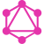

## Hi there! 👋, I'm [Karan!](https://github.com/karan316/)

I am into Full Stack Development using MERN     stack with a keen eye on UI/UX design. OPEN to full-time/freelance offers. 
Pursuing 📠Bachelor of Technology focused in 👨🏻‍💻 Computer and Communication Engineering from 🛠Manipal Institute of Technology.

 

	
	

 
-   👨🏻‍💻 MERN Developer, Product Designer
-   Currently Exploring:   

-   📫 How to reach me:
    -   Connect via LinkedIn: https://www.linkedin.com/in/karan-hejmadi/
    -   Website: https://karanhejmadi.netlify.app/
-   ⚡ Fun fact: A coder who doesn't rely on coffee. ☕

### Tech Stack

 

<code>
  
</code>
<code>

</code>
<code>

</code>
<code>

</code>
<code>

</code>
<code>

</code>
<code>

</code>
<code>

</code>

 

 

 

### Github Stats

    
    

